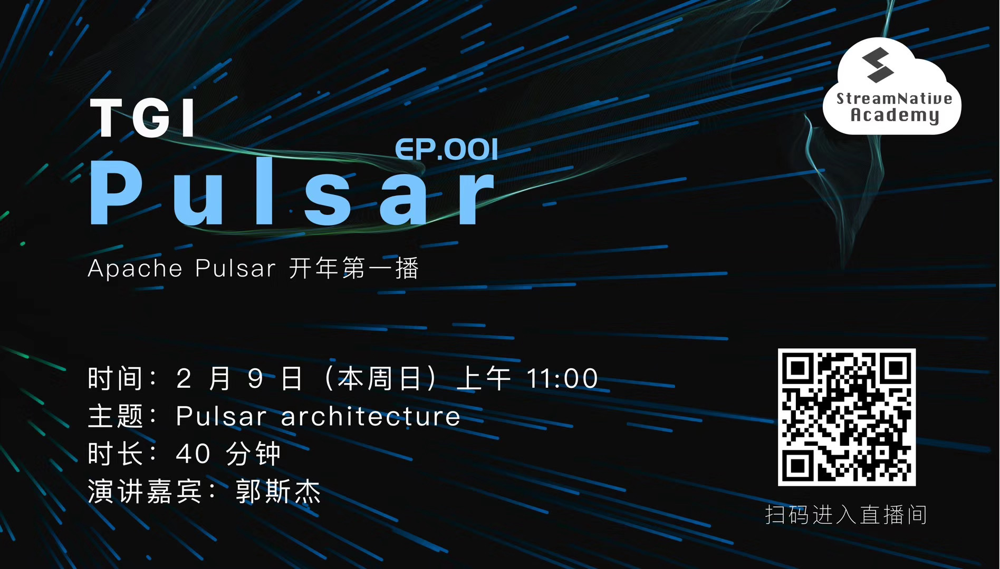

# Episode 001: Pulsar Basics

- Hosted by @sijie
- Recording 02/08/2020

## Table of Content

- 00:00:00 - Welcome to TGIP-CN!
- 00:00:00 - Week in Review
- 00:08:00 - Pulsar Basics

## Week in Review

- TGIP-CN: https://github.com/streamnative/tgip-cn
- Pulsar changes
    - Namespace level offloader: https://github.com/apache/pulsar/pull/6183
    - Supports evenly distribute topics count when splits bundle: https://github.com/apache/pulsar/pull/6241
- Pulsar User Survey
    - https://forms.office.com/Pages/ResponsePage.aspx?id=DQSIkWdsW0yxEjajBLZtrQAAAAAAAAAAAAZAAOjIXw9UMUNLRUdJMVJBS1RRNjVNNjMzR0JPTFpGWi4u

## Show Notes

- Event Streaming
    - Connect
        - Pub/Sub
        - Connector
        - Protocol handler
            - KoP
            - ActiveMQ
            - Rest
    - Store
        - Apache BookKeeper
        - Tiered storage
            - JCloud
                - AWS
                - GCS
            - HDFS

    - Process
        - Pulsar Function
        - Pulsar-Flink connector
        - Pulsar-Spark connector
        - Presto (Pulsar SQL)

- Pub/Sub
    - Produer
    - Topic
    - Partition
        - Segment
        - Entry
        - Message
    - Broker
    - Subscription
        - Subscription Mode
            - Exclusive
            - Failover
            - Shared
            - Key_Shared
        - Consumers
        - Cursors
        - Readers
    - Tenant
    - Namespace

## Reference 

- Hackmd Notes: https://hackmd.io/eARaViEeR3qCXA1RZFnDwQ?view
